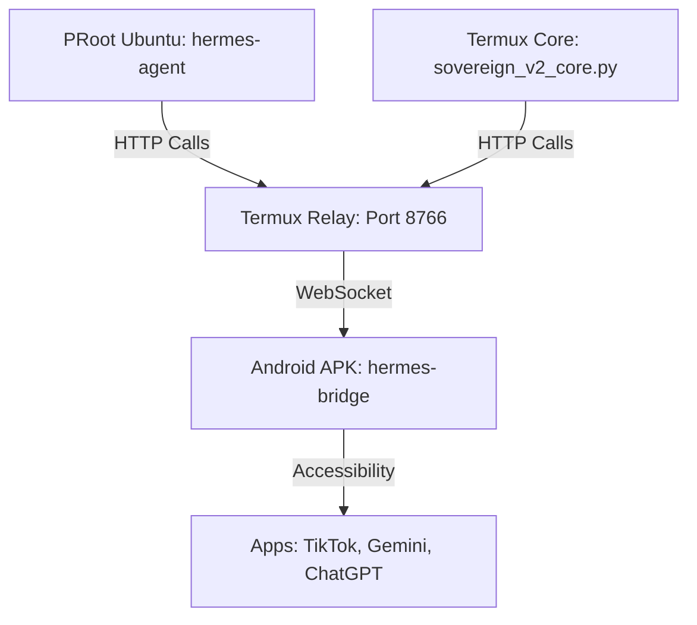

# Hermes Sovereign V2 Obsidian Knowledge Base Implementation Plan

> **For agentic workers:** REQUIRED SUB-SKILL: Use superpowers:subagent-driven-development (recommended) or superpowers:executing-plans to implement this plan task-by-task. Steps use checkbox (`- [ ]`) syntax for tracking.

**Goal:** Create a modular "Second Brain" for the Hermes Sovereign V2 system inside the user's Obsidian vault, mapping high-level architecture to machine-readable skill files.

**Architecture:** We will create four interconnected markdown files within the `~/storage/shared/HermesObsi/` directory. The root hub (`Sovereign_V2_Hub.md`) acts as a dashboard, linking to specialized workflow guides and a raw `SKILL.md` equivalent (`Skill_Sovereign_Orchestrator.md`) for direct AI ingestion.

**Tech Stack:** Markdown, Mermaid.js, Obsidian Wikilinks.

---

### Task 1: Initialize the Hub Document

**Files:**
- Create: `~/storage/shared/HermesObsi/Sovereign_V2_Hub.md`

- [ ] **Step 1: Write the Hub Markdown File**

```markdown
---
tags: [hermes, sovereign-v2, hub, dashboard]
aliases: [Master Hub, Sovereign Control]
---

# 🐉 Hermes Sovereign V2: The AI Agency Manager


## 🏗️ System Architecture



## 🔐 Connection Data
*   **Port:** `8766`
*   **Token:** Manual entry required. Do not use Zero-Config 8788.

## 🔗 Knowledge Base Links
*   [[Skill_Sovereign_Orchestrator]]: The machine-readable skill instruction set.
*   [[Workflow_Content_Empire]]: The "Mr. Beast" automated posting pipeline.
*   [[Workflow_Multi_Brain]]: AI routing (ChatGPT, NotebookLM, Gemini).

## ⚙️ Emergency Restart

```bash
pm2 delete all
fuser -k 8766/tcp
fuser -k 8767/tcp
pkill -9 python
python hermes_android_relay.py > relay.log 2>&1 &
python sovereign_v2_core.py > sovereign.log 2>&1 &
```
```

- [ ] **Step 2: Commit**

```bash
git commit -m "docs: create Sovereign V2 Obsidian Hub" --allow-empty
```

---

### Task 2: Create the Machine-Readable Skill Node

**Files:**
- Create: `~/storage/shared/HermesObsi/Skill_Sovereign_Orchestrator.md`

- [ ] **Step 1: Write the Skill Markdown File**

```markdown
---
name: hermes-sovereign-orchestrator
description: Core execution skill for controlling the Android device via the V2 Relay.
tags: [skill, ai-instruction, hermes]
---

# Skill: Sovereign Orchestrator

<instructions>
# Hermes Sovereign V2 Orchestrator Skill

You have access to `android_*` tools connected to `127.0.0.1:8766`.

## Prerequisite
Run `curl -s http://127.0.0.1:8766/ping?token=000000` to verify `connected: true`.

## Rules
1. ALWAYS use `android_read_screen()` to map the UI before tapping.
2. Locate elements by `text`, `content_desc`, or `id`.
3. Use `android_tap_text("text")` or `android_tap(x, y)`.
4. Only call `android_type("text")` AFTER tapping an input field.
5. If an app is missing, use `android_open_app("com.android.vending")` to install it.
</instructions>
```

- [ ] **Step 2: Commit**

```bash
git commit -m "docs: create machine-readable Sovereign Skill note" --allow-empty
```

---

### Task 3: Document the Content Empire Workflow

**Files:**
- Create: `~/storage/shared/HermesObsi/Workflow_Content_Empire.md`

- [ ] **Step 1: Write the Content Empire Markdown File**

```markdown
---
tags: [workflow, automation, content-empire]
---

# Workflow: Content Empire

This defines the Mr. Beast level cross-platform content automation.

## The Pipeline
1. **Ideation:**
   - Agent opens `com.openai.chatgpt`.
   - Prompts for a viral script or hook.
   - Extracts the response via `android_read_screen`.
2. **Assembly:**
   - Agent opens CapCut or Gemini to generate supporting assets.
3. **Distribution:**
   - **TikTok:** `com.zhiliaoapp.musically` -> Tap '+' -> Upload -> Type caption -> Post.
   - **Instagram:** `com.instagram.android` -> Tap '+' -> Reel -> Upload -> Post.
   - **YouTube:** `com.google.android.youtube` -> Tap '+' -> Create a Short -> Upload.

*Note: Ensure network stability. If rate limited, refer to [[Workflow_Multi_Brain]] for Self-Healing.*
```

- [ ] **Step 2: Commit**

```bash
git commit -m "docs: create Content Empire workflow documentation" --allow-empty
```

---

### Task 4: Document the Multi-Brain Routing

**Files:**
- Create: `~/storage/shared/HermesObsi/Workflow_Multi_Brain.md`

- [ ] **Step 1: Write the Multi-Brain Markdown File**

```markdown
---
tags: [workflow, multi-brain, ai-routing]
---

# Workflow: Multi-Brain Routing

Hermes acts as the CEO, delegating tasks to specific Android apps based on capability.

## Brain Assignments
*   **ChatGPT (`com.openai.chatgpt`):** Creative tasks, viral hooks, copywriting.
*   **NotebookLM (Browser):** Deep document research, large context summarization, audio podcast generation.
*   **Gemini (Native Android):** System-level tasks, image generation, and AppFunctions hand-offs.

## Self-Healing Protocol (Limit Bypass)
If an AI app reaches its rate limit:
1.  Agent navigates to the app's settings.
2.  Taps on the Profile icon.
3.  Selects an alternative Google account to continue processing seamlessly.
```

- [ ] **Step 2: Commit**

```bash
git commit -m "docs: create Multi-Brain routing documentation" --allow-empty
```
